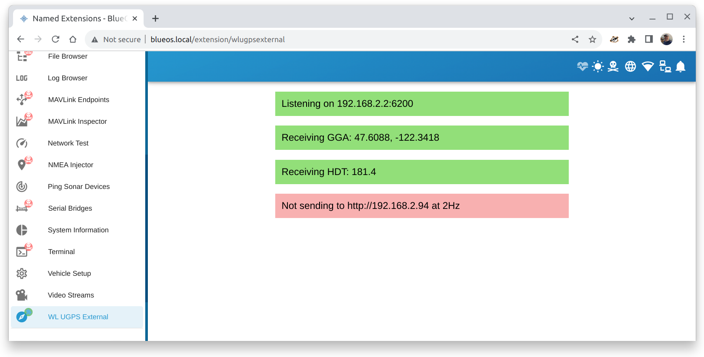
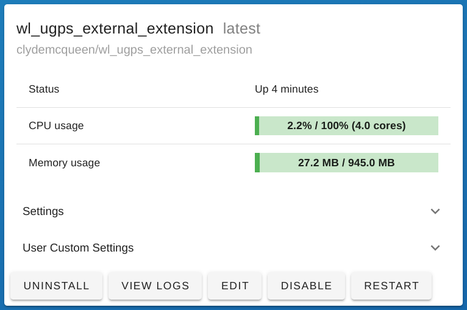

# WL UGPS External Position BlueOS Extension 

A simple [BlueOS Extension](https://docs.bluerobotics.com/ardusub-zola/software/onboard/BlueOS-1.1/development/extensions/)
that listens for NMEA messages (GGA and HDT) and sends position information to the
[Water Linked UGPS](https://waterlinked.com/underwater-gps-g2) system.

## Typical Configuration

Add a satellite compass to the vessel and connect it to the ROV Ethernet network.
* It should have a static IP address on the 192.168.2.X subnet
* It should send GGA and HDT messages via UDP to BlueOS at 192.168.2.2:6200

Install this extension in BlueOS:
* Select _Extensions_ in the sidebar, then the _Installed_ tab
* Click on the + icon in the lower right
* Enter the following information, then click _Create_

_Extension Identifier_
~~~
clydemcqueen.wl_ugps_external_extension
~~~

_Extension Name_
~~~
wl_ugps_external_extension
~~~

_Docker image_
~~~
clydemcqueen/wl_ugps_external_extension
~~~

_Docker tag_
~~~
latest
~~~

_Custom settings_
~~~
{
  "ExposedPorts": {
    "8080/tcp": {},
    "6200:6200/udp": {}
  },
  "HostConfig": {
    "PortBindings": {
      "6200/udp": [
        {
          "HostPort": "6200"
        }
      ],
      "8080/tcp": [
        {
          "HostPort": ""
        }
      ]
    }
  },
  "Env": [
    "UGPS_HOST=http://192.168.2.94",
    "SEND_RATE=2.0"
  ]
}
~~~

You should see the extension running:

After a few moments you should see the _WL UGPS External_ entry in the sidebar.
Click on it to see a very simple UI.

## Arguments

* `ugps_host` is typically `http://192.168.2.94`
* `send_rate` is typically 2Hz

## Caveats

* The G2 box still needs a GPS fix to synchronize its clock.
